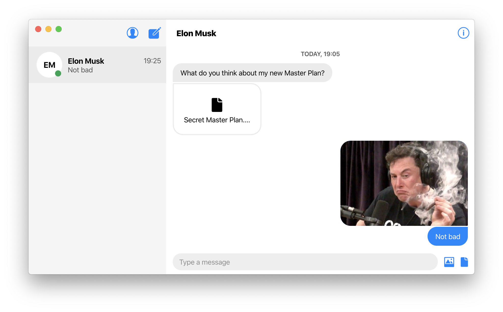
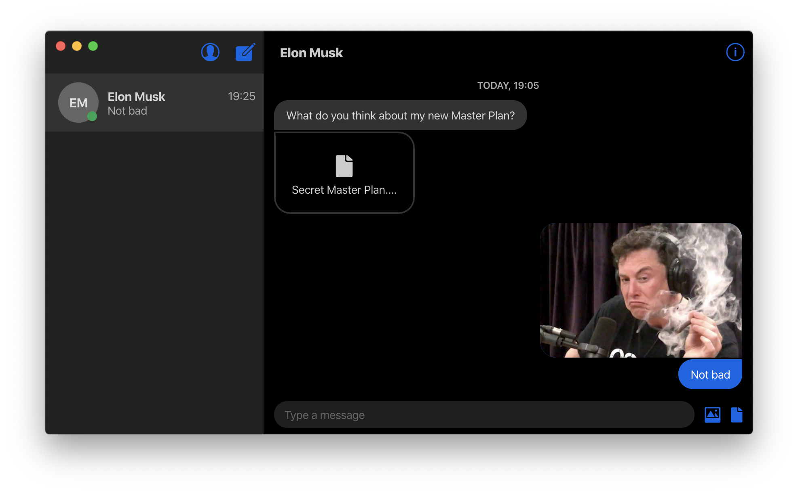

<h1 align="center">
  <br>
  <a href="https://github.com/HR/ciphora"></a>
  <br>
  Ciphora
  <br>
  <br>
</h1>

<h4 align="center">A decentralized end-to-end encrypted messaging app.</h4>
<p align="center">
    <a href="https://github.com/HR/ciphora/releases/latest">
        
    </a>
</p>

A peer-to-peer end-to-end encrypted messaging app. Implements the secure [signal
protocol](https://signal.org/docs/specifications/doubleratchet/) for the
end-to-end encryption of messages and
[PGP](https://en.wikipedia.org/wiki/Pretty_Good_Privacy) for identity
verification and authentication. This approach not only protects against
[man-in-the-middle
attacks](https://en.wikipedia.org/wiki/Man-in-the-middle_attack) but removes the
need for in-person verification like with other E2E encryption apps (WhatsApp,
Signal,...) where identity keypairs are generated on a per-device basis and each
has to be verified manually in-person.

<br>
<p align="center">
  <a href="https://github.com/HR/ciphora/releases/latest">
    
  </a>
</p>
<br>
<p align="center">
  <a href="https://github.com/HR/ciphora/releases/latest">
    
  </a>
</p>

## Features
- [x] End-to-end encrypted messaging
- [x] Peer-to-peer messaging
- [x] Sending images
- [x] Sending files
- [x] Dark Mode
- [ ] Offline messaging
- [ ] Local encryption


## Install

_macOS 10.10+, Linux, and Windows 7+ are supported (64-bit only)._

**macOS**

[**Download**](https://github.com/hr/ciphora/releases/latest) the `.dmg` file.

**Linux**

[**Download**](https://github.com/hr/ciphora/releases/latest) the `.AppImage` or `.deb` file.

_The AppImage needs to be [made executable](http://discourse.appimage.org/t/how-to-make-an-appimage-executable/80) after download._

**Windows**

[**Download**](https://github.com/hr/ciphora/releases/latest) the `.exe` file.


## Dev

Needs the Ciphora Server as well (https://github.com/HR/ciphora-server/)

### Setup

Clone the repos

```
$ git clone --recurse-submodules https://github.com/HR/ciphora.git
$ git clone https://github.com/HR/ciphora-server.git
```

Install deps for both repos

```
$ yarn
```

### Run

For faster dev, run the bundler (webpack)

```
$ yarn run bundler
```

In a new tty, run the app

```
$ gulp
```

To test the app locally with another app, just run a second instance in a new
tty

```
$ gulp
```

N.B. on macOS, you may be prompted to allow incoming connections everytime you
run it. Unfortunately the only way to make that go away currently is to disable
your firewall temporarily.

### Publish

```
$ npm run release
```

After Travis finishes building your app, open the release draft it created and
click "Publish".
